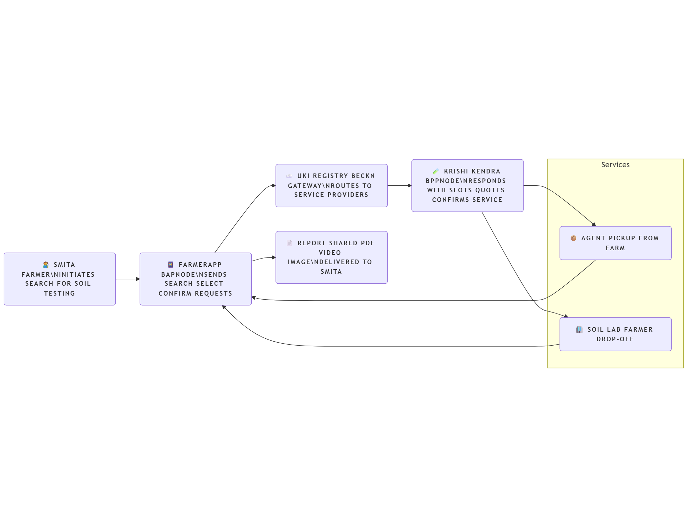
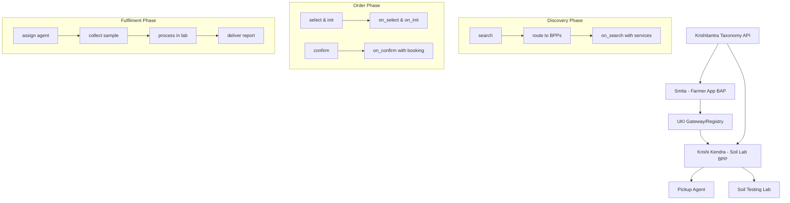

# 🌾 Beckn Implementation Guide – Outcome Visualization: Soil Testing (UKI)

## Overview

This guide demonstrates how to implement a soil testing service journey on the Unified Krishi Interface (UKI), using the Beckn Protocol. It is intended to help developers and network participants (BAPs, BPPs) understand the roles, flows, and technical implementation for integrating soil testing services.

The use case follows the DOFP (Discovery → Order → Fulfilment → Post-Fulfilment) model and highlights how a farmer (Smita) discovers, books, and receives soil testing services from a Beckn-compatible platform.

---

## Scope

- 📲 Actors: Farmer (BAP), Soil Testing Service Provider (BPP), Taxonomy APIs
- 🌐 Context: Soil testing discovery and service booking via Beckn-enabled agri platform
- 🔁 Protocol Flow: Beckn API lifecycle applied to Soil Testing

## Network Participants and Beckn Roles

This section explains the key entities involved in the soil testing use case and their mapped roles within the Beckn protocol ecosystem.

| **Entity**                       | **Beckn Role** | **Description**                                                                                            |
| -------------------------------------- | -------------------- | ---------------------------------------------------------------------------------------------------------------- |
| **Smita (Farmer)**               | BAP                  | Uses a Beckn-enabled agri app to search, book, and receive soil testing services.                                |
| **Krishi Kendra Soil Services**  | BPP                  | Provides soil testing services and integrates into UKI via Beckn. Responds to search, confirm, fulfill requests. |
| **Delivery Agent**               | Part of BPP          | Collects soil sample from Smita's farm or receives it at the testing center.                                     |
| **Krishitantra or Taxonomy API** | External System      | Provides standardized taxonomy like crop types, test categories, etc., used by both BAP and BPP.                 |
| **UKI Network Gateway**          | Registry/Router      | Facilitates discovery and message routing between BAP and BPP nodes.                                             |

---

## DOFP Journey – Soil Testing via Beckn

The interaction follows the standard Beckn protocol phases: **Discovery → Order → Fulfilment → Post-Fulfilment**, enabling an end-to-end digital journey for soil testing.

### 🔍 1. Discovery

- Smita (BAP) searches for soil testing services near her farm via the app.
- BPP (e.g., Krishi Kendra) responds with available services, including:
  - Ratings
  - Service types (NPK, micronutrients, etc.)
  - Cost, availability, and location
  - Pickup or drop-off options
- Smita filters and selects a preferred provider.

---

### 📦 2. Order

- Smita views detailed quote and service info.
- Krishi Kendra (BPP) shares:
  - Time slots
  - Pricing (pickup vs drop-off)
  - Pre-requisites (PDFs, videos)
  - Terms and conditions
- Smita confirms the service and selects payment (e.g., Cash on Delivery).
- BPP confirms the booking and provides order ID + pickup details.

---

### 🚚 3. Fulfilment

**Two modes:**

✅ **Farm Pickup**:

- Delivery agent visits Smita's farm, collects the soil sample.
- Payment is done at pickup.
- Smita receives real-time status updates.

✅ **Self Drop-off**:

- Smita collects the sample and delivers it to the testing center.
- She follows instructions shared earlier.
- She receives status updates post-drop.

---

### 🧾 4. Post-Fulfilment

- Smita receives a test report (PDF) with insights (text, video, image).
- She gives feedback/rating on:
  - Service quality
  - Provider behavior
- BPP can follow up for deeper insights.
- Smita can reach out to support if issues arise.

---

## Beckn API Flow – Soil Testing Journey

The following sequence represents the key API interactions between the BAP (Smita's app) and BPP (Krishi Kendra Soil Services) during the soil testing use case:

| **Step**   | **API**  | **Initiated By** | **Purpose**                                              |
| ---------------- | -------------- | ---------------------- | -------------------------------------------------------------- |
| 1️⃣ Search     | `search`     | BAP                    | Smita searches for nearby soil testing centers.                |
| 2️⃣ On Search  | `on_search`  | BPP                    | BPPs respond with matching services, slots, pricing, etc.      |
| 3️⃣ Select     | `select`     | BAP                    | Smita selects a preferred testing service.                     |
| 4️⃣ On Select  | `on_select`  | BPP                    | BPP confirms availability and responds with selection details. |
| 5️⃣ Init       | `init`       | BAP                    | BAP initiates the order request with all needed info.          |
| 6️⃣ On Init    | `on_init`    | BPP                    | BPP validates and confirms service initiation.                 |
| 7️⃣ Confirm    | `confirm`    | BAP                    | Final order confirmation with payment preference (COD).        |
| 8️⃣ On Confirm | `on_confirm` | BPP                    | BPP shares confirmed order ID, agent details.                  |
| 9️⃣ Status     | `status`     | BAP                    | BAP checks current status of collection/delivery.              |
| 🔟 Update        | `update`     | BPP                    | BPP pushes live status updates to BAP.                         |
| 🔁 Rating        | `rating`     | BAP                    | Smita gives feedback for the service post-fulfilment.          |
| ✅ On Rating     | `on_rating`  | BPP                    | BPP acknowledges feedback and may ask for follow-up.           |

---

### Notes:

- The sequence follows standard Beckn protocol lifecycles.
- All payloads conform to Beckn schema v1.2 (or latest supported by UKI).
- Multimedia content (videos/PDFs) is shared as URLs within payloads (e.g., `desc.url`).

---

## 🧭 High-Level System Flow Diagram

The following diagram illustrates the complete system architecture and participant interactions in the Beckn-powered soil testing ecosystem:



### System Components:



### Flow Description:

1. **Discovery Layer**:

   - Farmer (BAP) searches through UKI Gateway
   - Multiple BPPs respond with available services
   - Taxonomy API provides standardized categories
2. **Transaction Layer**:

   - Selected BPP handles order lifecycle
   - Payment and scheduling coordination
   - Real-time status updates
3. **Fulfilment Layer**:

   - Physical sample collection/drop-off
   - Laboratory processing and analysis
   - Digital report delivery and feedback

---

## Developer Notes, Tags & Assumptions

### 📌 Tags & Taxonomy Assumptions

- `collection_type`: "Farm Pickup" / "Drop-off at Centre"
- `test_type`: "NPK", "Micro Nutrients", "Soil Texture", "Water Test"
- `location.district` and `location.state`: Mapped to BPP serviceable zones
- `crop_type`, `crop_variety`: Sourced from Krishitantra's external API
- `media.url`: Used to share preparation instructions (PDF, image, video)

---

### ⚠️ Assumptions

- BAP supports local language input (Smita can search in Marathi).
- All payments are offline (COD), no digital transaction integration shown.
- Report sharing is asynchronous and happens via media URL in `update` or support contact.
- External taxonomy (e.g., crop categories) may evolve and are assumed dynamic.

---

### 💡 Developer Notes

- BAP & BPP nodes must be registered with UKI registry and follow Beckn OpenAPI schemas.
- All communication must be signed and timestamped as per protocol.
- Optional fields like `previous_crop`, `yield`, `feedback_rating` help enhance services but are not mandatory.
- System clocks must be in sync with IST (important for booking slots).
- Payloads stored in `/sample-payloads/` folder are simplified and can be expanded as needed.

---

## Sample Implementation Architecture

### BAP Implementation (Farmer App):

```javascript
// Example BAP search implementation
const searchSoilTesting = async (location, testType) => {
  const searchPayload = {
    context: {
      domain: "agri-soil-testing",
      action: "search",
      bap_id: "farmer-app.example.com",
      timestamp: new Date().toISOString()
    },
    message: {
      intent: {
        item: { descriptor: { name: testType } },
        fulfillment: {
          start: { location: { gps: location.coordinates } }
        }
      }
    }
  };
  
  return await beckn.search(searchPayload);
};
```

### BPP Implementation (Soil Lab):

```javascript
// Example BPP on_search response
const respondToSearch = async (searchRequest) => {
  const response = {
    context: {
      action: "on_search",
      bpp_id: "soil-lab.example.com"
    },
    message: {
      catalog: {
        bpp: {
          descriptor: { name: "ABC Soil Testing Lab" },
          items: [{
            id: "soil_test_001",
            descriptor: { name: "Basic NPK Test" },
            price: { currency: "INR", value: "500" },
            fulfillment: {
              type: "pickup",
              time: { range: { start: "09:00", end: "17:00" } }
            }
          }]
        }
      }
    }
  };
  
  return await beckn.respond(response);
};
```

---

## Integration Checklist

### For BAP Developers:

- [ ] Implement Beckn client SDK
- [ ] Register with UKI Gateway
- [ ] Handle async callback responses
- [ ] Implement local language support
- [ ] Add location services integration
- [ ] Implement payment gateway (future)

### For BPP Developers:

- [ ] Implement Beckn provider SDK
- [ ] Register services with UKI Registry
- [ ] Set up webhook endpoints for callbacks
- [ ] Integrate with lab management system
- [ ] Implement agent tracking system
- [ ] Set up report generation pipeline

---

## Testing and Validation

### API Testing:

- Use Beckn Protocol test suite
- Validate JSON schema compliance
- Test timeout and retry mechanisms
- Verify digital signature validation

### End-to-End Testing:

- Complete farmer journey simulation
- Multi-BPP discovery scenarios
- Error handling and edge cases
- Performance under load

---

## Appendix: Related Resources

- [Beckn Protocol Specification](https://developers.becknprotocol.io/)
- [UKI Implementation Guidelines](https://uki.gov.in/developers)
- [Krishitantra Taxonomy API](https://krishitantra.gov.in/api)
- [Sample Payloads](./sample-payloads/)
- [System Flow Diagram](./assets/system-flow.png)

---

*This implementation guide serves as a comprehensive reference for integrating soil testing services into the Beckn-powered Unified Krishi Interface ecosystem.*
